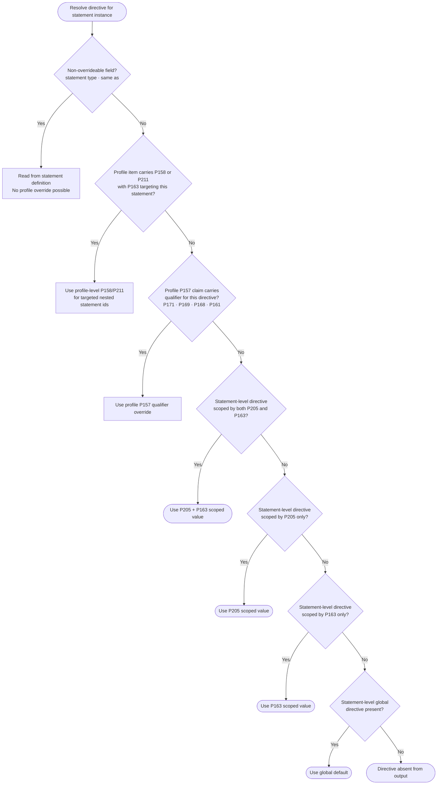

# Data Distillery Wikibase

Data Distillery Wikibase (`datadistillery.wikibase.cloud`) is the semantic registry for GKC ontology terms, profile metadata relationships, statement/value-list semantics, and multilingual guidance content that must be queryable and collaboratively maintained.

This page focuses on one part of a three-part infrastructure model:

- **Data Distillery Wikibase**: semantic source of truth.
- **SpiritSafe repository**: materialized artifact registry.
- **GKC Python package**: runtime execution layer.

## Why This Exists

The runtime and collaboration needs are different:

- SpiritSafe JSON profile artifacts are optimized for offline execution and deterministic profile consumption.
- Wikibase is optimized for semantic relationships, multilingual fields, and query-oriented discovery.

The Data Distillery uses a hybrid model where both sides are maintained in sync.

Authoring and execution split:

- DD Wikibase holds foundation semantics.
- SpiritSafe holds deterministic materialized/actionable artifacts.
- `gkc` consumes materialized artifacts and runs curation/validation/shipping workflows.

## Current Architecture Contract

### Source-of-Truth Position

- JSON Entity Profiles and cache artifacts remain the actionable artifacts consumed by runtime code.
- Wikibase stores semantic linkage and metadata that improve queryability and collaboration.
- Transformations between Wikibase and SpiritSafe must be lossless and testable.

This establishes a clear semantic chain for all core architectural components:

- Entity Profiles: authored in DD, materialized in SpiritSafe, executed in `gkc`.
- Entity Statements: authored in DD, embedded/materialized in profile artifacts, evaluated in `gkc`.
- Value Lists: authored in DD, hydrated in SpiritSafe, applied in packet/wizard validation.
- Curation Packets: assembled and charged in `gkc` from SpiritSafe artifacts while retaining DD-linked canonical IDs.

### Top-Level Semantic Components

The Data Distillery Wikibase architecture is organized around three primary item types:

- GKC Entity Profile.
- GKC Entity Statement.
- GKC Value List.

These components are designed to work together as a layered model where profiles compose reusable statements and statements can bind to curated value lists.

Curation Packets are the runtime integration construct generated by `gkc` from materialized profile artifacts; they are not authored directly in DD Wikibase, but their structure is semantically grounded in DD-defined profile/statement/value-list directives.

Profiles and statements are equal-priority architectural components:

- Profiles provide context, composition, and modulation.
- Statements provide reusable semantic units that can span many profiles.

Validation and packet design should treat both as first-class runtime entities.

### Component: GKC Entity Profile

Purpose:
Defines an entity-shaped curation surface, including identification prompts and statement composition for packet and wizard workflows.

Profile-level identification messaging fields include:

- `label prompt` (P188)
- `label guidance` (P185)
- `description prompt` (P189)
- `description guidance` (P186)
- `alias prompt` (P190)
- `alias guidance` (P187)

Key responsibilities:

- Declares which statement instances are used for the entity context.
- Links claim statements to expected qualifier and reference statements.
- Hosts profile-context modulation where entity-specific behavior must differ from reusable statement defaults.

Profile statements are declared via `has statement` (P157), where each claim links to a GKC Entity Statement item.

Each P157 claim may include profile-level override qualifiers for:

- `statement prompt` (P171)
- `statement guidance` (P169)
- `error message` (P168)

These profile-level qualifiers override the corresponding defaults defined on the linked GKC Entity Statement when exporting profile JSON.

Each P157 claim may also include `has value` (P161).

P157-level P161 follows the same value-linkage semantics as statement-level P161 and may link to:

- GKC Entity Profile and/or GKC Value List for select-or-create behavior.
- GKC Value List for selection-only behavior.
- Wikibase Entity for fixed-value behavior resolved through `same as`.

When both profile-level and statement-level P161 are present for the same statement instance, profile-level P161 takes precedence.

#### Profile-Level Qualifier and Reference Overrides

A profile item may also carry `has qualifier` (P158) and `has reference` (P211) claims at the profile level.

These claims must be qualified with `applies to statement` (P163), linking the override to the specific P157 statement instance within that profile to which it applies.

When present, profile-level P158 and P211 claims with P163 are evaluated as targeted statement-spec overrides for that statement in that profile.

Override behavior is partial, not wholesale:

- For nested statement specifications explicitly present at profile level, profile-level qualifiers win over statement-level defaults for those same nested statement ids.
- For nested statement specifications not present at profile level, statement-level defaults still flow through.

This mechanism allows profile authors to declare statement-specific qualifier and reference rules directly on the profile item without modifying the underlying GKC Entity Statement definitions.

### Profile JSON Assembly Precedence

When assembling a profile into JSON, specifications are resolved in the following order for each statement instance, from highest to lowest precedence:

1. Profile-level P158/P211 claims with P163 targeting this statement.
2. Profile-level P157 qualifier overrides (P171, P169, P168, P161) on the specific P157 claim.
3. Statement-level P158/P211 scoped by both P205 and P163.
4. Statement-level P158/P211 scoped by P205 only.
5. Statement-level P158/P211 scoped by P163 only.
6. Statement-level global defaults (no P205 or P163 qualifiers).

When a higher-precedence rule is present and covers a directive, lower-level rules for the same directive are excluded from the exported JSON for that statement instance.

The following fields are always present in exported statement JSON regardless of overrides, providing a guaranteed contract for downstream consumers:

- `statement type` (from P194) — not overrideable from the profile.
- `same as` mappings (from P5) — not overrideable from the profile.
- `max count` (from P182, profile-level override permitted).
- `statement prompt` (from P171, resolved through precedence).
- `statement guidance` (from P169, resolved through precedence).
- `error message` (from P168, resolved through precedence).

#### Directive Resolution Matrix

The table below summarizes each directive: where it can be defined, what resolution rule applies when multiple sources compete, and whether it is guaranteed in every exported statement JSON.

| Directive | Where Definable | Resolution Rule | Guaranteed in Output |
|---|---|---|---|
| `statement type` (P194) | Statement only | No override; statement definition is authoritative | Yes |
| `same as` (P5) | Statement only | No override; statement definition is authoritative | Yes |
| `max count` (P182) | Statement or profile P157 qualifier | Profile P157 qualifier wins; statement-level baseline otherwise | Yes |
| `statement prompt` (P171) | Statement (any scope) or profile P157 qualifier | Profile P157 qualifier wins over all statement-level variants | Yes |
| `statement guidance` (P169) | Statement (any scope) or profile P157 qualifier | Profile P157 qualifier wins over all statement-level variants | Yes |
| `error message` (P168) | Property template, statement (any scope), or profile P157 qualifier | Profile P157 qualifier wins; statement-level wins over property template fallback | Yes |
| `has value` (P161) | Statement (any scope) or profile P157 level | Profile P157-level P161 wins over all statement-level variants | No |
| `has qualifier` (P158) | Statement (any scope), P157 qualifier, or profile P158 + P163 claim | Per nested statement id: profile-level wins when present; otherwise statement-level/default sources flow through | No |
| `has reference` (P211) | Statement (any scope), P157 qualifier, or profile P211 + P163 claim | Per nested statement id: profile-level wins when present; otherwise statement-level/default sources flow through | No |

#### Resolution Flow

The following diagram illustrates the resolution algorithm applied for each directive when assembling a statement instance into profile JSON. Non-overrideable fields (P194, P5) skip this flow entirely — they are read directly from the statement definition. Max count (P182) enters the flow at the profile P157 qualifier check.



### Component: GKC Entity Statement

Purpose:
Represents a reusable statement primitive used for claims, qualifiers, and references.

Expected statement-level configuration commonly includes:

- `statement type` (P194), linked to a Wikibase Property Template.
- `same as` (P5), used for canonical cross-system URI/PID mappings.
- `max count` (P182), with numeric quantity or `novalue` for unbounded cardinality.
- `statement prompt` (P171), default short prompt text.
- `statement guidance` (P169), default longer guidance text.
- `error message` (P168), canonical failure message when required content is missing.

Architectural role:

- Provides reusable defaults and shared semantics across profiles.
- Carries statement-level directives such as value, qualifier, and reference expectations.
- Supports scoping qualifiers for profile-specific or parent-statement-specific behavior.

#### Statement Minimum Shape

For curation and validation architecture, a statement is treated as a compound data object with a minimum shape of:

- value
- reference
- provenance

Reference is itself statement-like and follows statement semantics.

Provenance must capture presentation circumstances at minimum, including how, when, and by whom the statement was stated.

Additional provenance depth may be included by profile context, but packet and fermenter workflows should assume this minimum shape as the baseline contract.

### Statement-Level Directive Semantics

The following properties are used as directives on GKC Entity Statement items:

- `has value` (P161)
- `has qualifier` (P158)
- `has reference` (P211)

For P158 and P211, directive values link to other GKC Entity Statement items.

#### `has reference` (P211)

`has reference` links a parent statement to one or more statement definitions expected as references.

Current derived-default pattern:

- A P211 linkage may carry a `derives default value from` (P213) qualifier.
- P213 points to a DD Wikibase item indicating the source for default value derivation.
- For the `official website` pattern, `official website` links to `reference URL` via P211 with P213 targeting the parent statement item.
- Effective behavior: when an `official website` statement is used in a profile, a `reference URL` reference is auto-applied with value derived from the parent statement value.

This pattern is architecturally committed and should be treated as a general mechanism for future derived-default reference behavior, not as a one-off special case.

#### `has qualifier` (P158)

`has qualifier` links to statement definitions expected as qualifiers for the parent statement.

Current behavior:

- P158 links are interpreted as expected qualifier statements for any profile statements using the parent statement.
- These links currently operate as direct expected-qualifier declarations.

Future capability:

- P158 linkages may carry specialized qualifiers to refine applicability or value behavior.

#### `has value` (P161)

P161 on statement items follows the established value semantics and is primarily used for wikibase-item type statement definitions.

Supported linkage patterns:

- Link to a GKC Entity Profile or GKC Value List to support either selection from allowed items or creation via linked profile flow.
- Link to a GKC Value List for selection-only behavior.
- Link to an item classed as a Wikibase Entity to represent a fixed value, resolved via that item's `same as` mapping.

These patterns must remain deterministic in profile export and preserve compatibility with offline SpiritSafe consumption.

### Component: GKC Value List

Purpose:
Represents a curated allowed-item set that constrains value selection for wikibase-item type statement definitions. The goal is to have a value list behind every case where a curator must select one or more Wikidata items as the object of a statement.

Key responsibilities:

- Encodes reusable value domains linked from statement value directives (P161).
- Scopes allowed-item sets to either universal applicability (any profile using the statement) or profile-specific contexts.
- Hosts the SPARQL query used to hydrate the list from Wikidata or Qlever.
- Carries a refresh policy that governs how and when the list is refreshed.
- Supports deterministic offline consumption via pre-hydrated SpiritSafe cache artifacts.

#### Required Value List Configuration

- `instance of` (P1): must classify the item as GKC Value List (Q28).
- `refresh policy` (P210): links to a refresh policy item (e.g., `manual refresh`, Q50). This governs cache update cadence.

#### SPARQL Query Storage

The SPARQL query for each value list is stored in a `<sparql></sparql>` block in the item's Mediawiki talk/discussion page. This allows queries of arbitrary length and direct execution against Wikidata or Qlever without datatype length constraints.

Current limitation: retrieving the query requires a Mediawiki API call to read the discussion page, which adds a network dependency during refresh. This is an acceptable tradeoff at current scale but may be revisited if retrieval becomes a bottleneck.

##### Side note: storing SPARQL in item data directly

Monolingual text fields in Wikibase are capped at 400 characters, which is insufficient for meaningful SPARQL queries. External identifiers and string fields share the same constraint. A Wikibase string property with a longer cap would require a custom Wikibase extension or a non-standard configuration — not viable for a hosted instance. Storing the query as a file in the SpiritSafe repository is an alternative but decouples the query from the Wikibase item it belongs to and requires manual synchronization. The discussion-page approach keeps query and item co-located in Wikibase while working within platform constraints. For now, the discussion-page pattern is the committed mechanism.

#### Query Construction Principles

Value list queries are constructed from Wikidata property constraint information (allowed values, class constraints) but are not mechanically derived from constraints alone. Each query should:

- Target Wikidata or Qlever as the execution endpoint.
- Return items appropriate for the statement type in the context of use.
- Where constraints exist, use them as a starting point and adjust for practical coverage based on domain knowledge.
- Include a `LIMIT` sufficient for the expected list size.

#### Scoping

A value list may be universal (applicable whenever its linked statement is used) or profile-specific (applicable only in a specific entity profile context). Profile-specific scoping is encoded at the P161 linkage on the statement or profile item using `applies to profile` (P205) qualifiers.

### Composition Model

Profiles compose statement instances. Statements may link to other statements (for qualifier/reference expectations) and to value lists (for constrained value selection).

Core principles:

- Statement-level defaults should remain reusable and broadly applicable.
- Profile-level directives should capture entity-context specialization.
- Resolution behavior must be deterministic and auditable.

### Curation Packet as Composition Vehicle

The Curation Packet is where profile rules, statement rules, source data capabilities, and evaluation artifacts are assembled into one runtime structure.

This model must support both broad and thin packet shapes:

- profile-broad packets that include full profile-composed statement sets
- statement-thin packets that slice a single statement across all applicable entities or all occurrences in scope

Both packet modes should use the same statement and profile contracts so validation, coercion, and notice semantics remain consistent.

### Conformance Semantics

Fermenter conformance is target-state oriented, not strict required-field enforcement.

In this model:

- Profile statements represent expected curation coverage for an entity type.
- Runtime validation/coercion accepts partial and incomplete entities as normal operating reality.
- Missing expected statements, qualifiers, or references produce actionable conformance notices with severity, not automatic hard-failure by default.
- Hard-failure behavior is policy-driven and should be applied only where explicitly configured.

Cardinality interpretation:

- `max count` (P182) defines upper-bound target semantics.
- Lower-bound expectation is effectively zero in current operating practice unless an explicit minimum policy is introduced.
- `novalue`/unbounded forms remain valid where modeled.

Validation and coercion must stay statement-instance scoped:

- Notice and resolution logic is anchored to the active profile statement instance.
- Optional parent-statement scope (`applies to statement`, P163) and profile scope (`applies to profile`, P205) determine contextual applicability.
- This preserves deterministic behavior across wizard, CLI, and batch packet workflows while supporting incremental curation improvement.

### Scoping and Rule Resolution

For statement-level directives that include applicability qualifiers:

- No P205 or P163 qualifiers: global default.
- P205 only: applies only to matching profile context.
- P163 only: applies only when parent statement context matches.
- P205 and P163: both profile and parent statement must match.

When multiple directives collide, resolution should favor higher specificity first, with explicit diagnostics for unresolved same-specificity conflicts.

Derived-default note:

- `derives default value from` (P213) is applied in the context of statement-to-statement linkage resolution (for example, a P211-linked reference statement).
- The value source for a derived statement instance is the linked source statement item designated by P213.
- This value-derivation contract is intended to be reusable for additional statement-linkage patterns as they are introduced.

### Wikibase Property Template Integration

Wikibase Property Template items define datatype-level defaults that are reusable across statement definitions.

In addition to datatype labeling, property templates may carry `error message` statements that are specific to datatype validation and entry expectations.

Property-template error messages are directly applicable defaults for statements using that template, unless a more specific statement-level or profile-level message overrides them.

### Foundation Modeling

Legacy `foundation_profiles` artifacts are non-authoritative for the current Profiles V2 and Fermenter V1 direction.

Current contract:

- Live Data Distillery Wikibase semantics are the authoritative source for semantic identifiers and relationships.
- SpiritSafe artifacts remain the authoritative runtime materialization for offline execution.
- `gkc wikibase audit` and related workflows remain useful operational tools, but they should not be treated as the primary semantic authority contract.

### Operational Modes

- Offline-first operation is a hard requirement.
- Network access to Data Distillery is an optional enhancement, not a runtime dependency for core profile-driven workflows.
- SpiritSafe cache and manifest artifacts support deterministic fallback behavior.

### SpiritSafe Synchronization Boundary

- Wikibase is the semantic collaboration layer.
- SpiritSafe artifacts are generated synchronization outputs consumed by runtime paths.
- Entity cache refresh and profile build/export are independently invokable operations to support iterative modeling.

## Current CLI Behavior

### `gkc wikibase audit`

- Reads Data Distillery runtime settings from `DD_WB_*` environment variables.
- Uses authenticated mode when credentials are valid.
- Falls back to anonymous session on login failure unless `--require-auth` is provided.
- Produces summary output and optional JSON report via `--output`.

### `gkc wikibase init`

- Runs an audit pass first and builds create/skip action records.
- Defaults to dry-run preview mode.
- Requires explicit `--execute` to submit writes.
- Requires authentication; supports environment credentials or `--interactive` prompt flow.
- Supports explicit edit summaries and bot marking controls (`--summary`, `--bot`).

### SpiritSafe Cache and Build Workflows

- `Cache from Wikibase` refreshes entity cache incrementally from Wikibase changes.
- `Cache Wikibase and Build Profiles` refreshes cache and regenerates profile JSON artifacts.
- `Hydrate Value Lists` refreshes query and allowed-item list artifacts.

## Shipper API Contract Notes (Data Distillery)

For property creation with `wbeditentity`, Data Distillery currently requires `datatype` inside the serialized `data` JSON payload for `new=property` requests.

Do not send `datatype` as only a top-level form parameter for this instance.

This behavior is treated as an instance contract until validated across additional Wikibase targets.

## Theoretical Design Notes

The following items reflect active architectural exploration and are not yet finalized implementation contracts.

- Profile-local statement-instance directives may become the primary effective configuration surface, with statement-level rules serving as reusable defaults.
- A dedicated suppression/removal semantic may be introduced for qualifier/reference collisions instead of relying on absence semantics.
- Additional explicit conflict-reporting structures may be emitted in profile generation reports to improve curation diagnostics at scale.
- URL interpretation and domain-rule semantics are expected to be modeled in Data Distillery so wizard and fermenter URL handling can use a shared ontology-backed rule registry.

## Environment Variables

- `DD_WB_API_URL`
- `DD_WB_SPARQL_ENDPOINT`
- `DD_WB_USERNAME`
- `DD_WB_PASSWORD`

Recommended baseline:

```bash
export DD_WB_API_URL="https://datadistillery.wikibase.cloud/w/api.php"
export DD_WB_SPARQL_ENDPOINT="https://datadistillery.wikibase.cloud/query/sparql"
export DD_WB_USERNAME="your_dd_username"
export DD_WB_PASSWORD="your_dd_password"
```

## Troubleshooting

- **Auth group mismatch**: if credentials authenticate but write requests fail, verify Data Distillery account permissions include edit rights.
- **Write summary missing**: shipper write operations and init flows require a non-empty summary.
- **Property create datatype error**: ensure datatype is embedded in the `data` payload JSON for property creation.

## Related Documentation

- [Setup and Orientation](../gkc/setup.md)
- [Authentication Guide](../gkc/authentication.md)
- [Cross-Module Contracts](module-contracts.md)
- [Shipper API](../gkc/api/shipper.md)
- [CLI Reference](../gkc/cli/index.md)