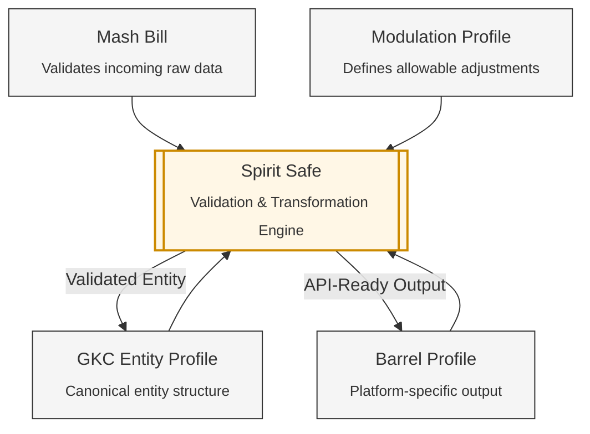

## Introduction

The **Global Knowledge Commons (GKC)** is a framework for understanding and working with structured knowledge that spans multiple open, public platforms. The initial design focuses on Wikidata, Wikimedia Commons, Wikipedia's infoboxes, and OpenStreetMap. Each of these systems captures part of the world, but none provides a unified, actionable representation of real‑world entities across platforms. The GKC fills that gap by defining cross‑platform entity models, transformation rules, and platform‑specific output structures that allow knowledge to move coherently through the entire ecosystem.

To make this underlying plumbing work a bit more compelling (and to have fun with things!), the GKC adopts the metaphor of a **data distillery**. Distillation provides a vivid way to describe how raw, heterogeneous inputs can be validated, transformed, refined, and ultimately bottled into the formats required by different Commons platforms. The metaphor is not decorative — it helps clarify the stages of the workflow, the roles of different components, and the logic behind the architecture. Mash Bills describe the structure of incoming data, Modulation Profiles guide how that data can be shaped, GKC Entity Profiles define the canonical form of an entity, and Barrel Profiles encode the exact structure required by downstream platforms. The Spirit Safe serves as the execution engine that validates and transforms data as it moves through these stages.

Together, the Global Knowledge Commons and the Data Distillery provide a coherent, extensible approach to building, maintaining, and publishing structured knowledge across the public open knowledge ecosystem.

----

## Profile Architecture
Profiles are the core organizing structures of the Global Knowledge Commons. Each Profile type captures a different facet of how knowledge moves through the distillation pipeline — from raw, heterogeneous inputs, to unified cross‑platform representations, to platform‑specific outputs, and finally to the rules that govern how entities can be created or maintained. Together, these Profiles form a coherent, extensible framework for understanding, validating, transforming, and publishing structured knowledge across the Commons.

While Profiles define *what* data looks like and *how* it should behave, the **Spirit Safe** is the execution layer that enforces these definitions. It is where Profiles become actionable: where validation occurs, where transformations are applied, and where data is prepared for bottling into Commons platforms.

---

### Global Knowledge Commons Profile
**Plain Meaning:** defines the canonical structure and meaning of an entity, independent of any specific platform’s constraints or APIs

A **Global Knowledge Commons Profile (GKC Entity Profile)** is the unified, cross‑platform representation of a real‑world entity within the GKC ecosystem. It synthesizes structure, semantics, and expectations drawn from diverse sources — Wikidata property definitions, ShEx schemas, Wikipedia infoboxes, Commons SDC patterns, OSM tagging conventions, and domain‑specific formal schemas — and distills them into a single, coherent, Pydantic‑based model.

A GKC Entity Profile provides:

- **A cross‑platform conceptual definition** of what a given kind of entity *is* in the Global Knowledge Commons.  
- **A harmonized abstraction** that resolves inconsistencies across platforms and community conventions.  
- **A functional, executable model** that includes validation logic, coercion rules, and semantic expectations.  
- **A stable foundation** from which multiple Modulation Profiles can be derived.  
- **A durable, reviewable artifact** that evolves as understanding of the entity type deepens.

---

### Modulation Profile
**Plain Meaning:** defines *how* a GKC Entity can be filled, adjusted, or maintained in practice

A **Modulation Profile** defines how a GKC Entity may be populated, edited, or maintained — whether through one‑off human input, assisted workflows, or automated batch processes. It specifies the *mutable surface* of the entity: which fields can be changed, what inputs are required or optional, how user intent maps into the GKC Entity Profile, and what transformations are permissible.

A Modulation Profile provides:

- **Rules for controlled mutability**, distinguishing fixed characteristics from editable ones.  
- **Input models** that guide human or machine contributors through structured data entry.  
- **Workflow‑specific logic**, enabling different modulation strategies for different contexts (e.g., tribal governments vs. sovereign states).  
- **A bridge between user input and the GKC Entity Profile**, ensuring all changes remain valid and coherent.  
- **Support for both interactive and batch processes**, including repeated maintenance operations.

---

### Barrel Profile
**Plain Meaning:** defines the exact shape of an entity as it must appear in a specific Commons platform, ready for API submission or template rendering

A **Barrel Profile** is the platform‑specific, API‑ready representation of a GKC Entity for a particular outlet in the Commons — such as Wikidata, Wikimedia Commons (SDC), Wikipedia infoboxes, or OpenStreetMap features. It encodes the exact structure, formatting, and validation rules required by each platform’s APIs or data ingestion mechanisms.

A Barrel Profile provides:

- **A precise, Pydantic‑based output model** tailored to a specific platform’s requirements.  
- **Stable, predictable structure** that changes only when the platform’s APIs or conventions change.  
- **Executable validation and coercion logic** that ensures outputs conform to platform expectations.  
- **A clear separation** between cross‑platform entity understanding (GKC Entity Profile) and platform‑specific implementation details.  
- **A reliable foundation** for automated “bottling” into Wikidata, Commons, OSM, or infobox templates.

---

### Mash Bill
**Plain Meaning:** defines the expected structure and quality of the raw data used to create or update a GKC Entity, ensuring that every distillation run begins with a predictable and validated foundation

A **Mash Bill** defines the structure, expectations, and validation rules for the *incoming data* used to construct or update a GKC Entity. It describes the composition of the raw material — the fields, formats, sources, and content patterns that are expected when processing a particular class of inputs. Mash Bills are semi‑permanent architectural fixtures: stable enough to be versioned and reviewed, but flexible enough to evolve as upstream data sources change.

A Mash Bill provides:

- **A structured definition of expected input data**, including fields, types, formats, and provenance.  
- **Pydantic‑based validation and coercion logic** to ensure that each incoming “mash” conforms to expectations before processing begins.  
- **A bridge between heterogeneous external data sources** (CSV files, APIs, spreadsheets, domain‑specific schemas, harvested Wikidata items, etc.) and the GKC Entity Profile.  
- **A stable reference point** for building Modulation Profiles, which define how the mash is transformed into a GKC Entity.  
- **A mechanism for identifying unusable or incomplete input** — the “Angel’s Share” — so that only viable data proceeds into the distillation workflow.

---

### Spirit Safe
**Plain Meaning:** the execution and validation engine that ensures all Profiles behave as intended

The **Spirit Safe** is the operational heart of the GKC distillation pipeline. It is where Profiles become executable: where Mash Bills are validated, where Modulation Profiles are applied, where GKC Entity Profiles are instantiated, and where Barrel Profiles are checked before bottling. Implemented through Pydantic models and custom validation logic, the Spirit Safe ensures that every transformation is correct, consistent, and aligned with both cross‑platform semantics and platform‑specific requirements.

The Spirit Safe provides:

- **Executable validation** of all Profile types, ensuring structural and semantic correctness.  
- **Controlled transformation** of raw input into fully realized GKC Entities.  
- **A consistent enforcement layer** that applies rules from Mash Bills, Modulation Profiles, and Barrel Profiles.  
- **A safe, inspectable environment** where data can be examined, corrected, or rejected before being bottled into Commons platforms.

In short:  
**The Spirit Safe is where the architecture becomes real — the place where Profiles are enforced, transformations occur, and data is prepared for publication.**

#### Future Trajectory
We are building the Spirit Safe concept as a distinct set of code and functionality within the gkc package for its initial phase. However, it will likely become a separate, fairly lightweight Python package and a profile repository where we can implement unique CI workflows that include review and approval steps and distinct versioning.

----

## Mash Tun
**Plain Meaning:** the interactive and programmatic workspace where raw data is clarified, aligned, and prepared for transformation into GKC Entities

The **Mash Tun** is the operational entry point of the Data Distillery. It is where raw inputs — whether harvested from Wikidata, extracted from spreadsheets or APIs, or supplied directly by a human user — are first gathered, clarified, and shaped into a form suitable for processing through the GKC architecture. The Mash Tun combines two equally important capabilities: **profile‑building** (understanding and harmonizing raw structures) and **data‑building** (collecting and preparing actual entity data).

The Mash Tun provides:

- **Programmatic ingestion and harmonization** of raw Wikidata items, properties, and Entity Schemas, using the `mash` module to extract structure, identify patterns, and align inputs toward the expectations of a GKC Entity Profile.  
- **Initial structural clarification**, performing early normalization, type inference, and field alignment to reduce ambiguity before deeper validation occurs.  
- **Interactive data‑entry experiences**, including CLI‑based prompts, notebook widget forms, and future web‑based interfaces, all driven by Modulation Profiles to ensure that user input is structured, complete, and semantically meaningful.  
- **A unified preparation layer** that supports both one‑off human edits and automated or semi‑automated batch processes, ensuring that all incoming data — regardless of source — enters the distillation pipeline in a predictable and inspectable form.  
- **A bridge between raw inputs and the Spirit Safe**, producing well‑formed intermediate representations that can be validated, transformed, and instantiated as GKC Entities.

In short:  
**The Mash Tun is where raw data meets structure — a workspace that harmonizes incoming material and guides human or automated contributors in preparing data for transformation into GKC Entities.**
