# GKC Pipeline Overview

The Data Distillery Workflow transforms raw, disconnected data into refined, linked open data through a series of intentional stages. Each stage adds value: cleaning, linking, validating, and ultimately preparing data for contribution to open knowledge sources.

At the heart of this workflow is a **two-schema architecture**: source data is first mapped to a **Unified Still Schema** (meta schema), which then enables distribution after distillation to multiple target systems via **Barrel Schemas** and **Barrel Recipes**. This design promotes simultaneous contribution to Wikidata, OSM, Commons, and Wikipedia from a single transformation pipeline.

## The End-to-End Vision

```mermaid
%%{init: {'flowchart': {'nodeSpacing': 100, 'rankSpacing': 100, 'htmlLabels': true, 'primaryTextColor': '#333'}, 'fontSize': 18}}%%
graph TD
    subgraph sources["🥔 Raw Ingredients"]
        CSV["CSV Files"]
        JSON["JSON APIs"]
        SHEETS["Spreadsheets"]
        RDF["RDF/Linked Data"]
        OSM["OSM Extracts"]
    end

    subgraph ingestion["Stage 1: Data Ingestion"]
        MASHBILL["<b>Mash Bill</b><br/>Source Specs<br/>━━━━━━━━━━━━<br/>Format definitions<br/>Field mappings<br/>Parse rules"]
        MASH["<b>Mash Tun</b><br/>Parse & Structure<br/>━━━━━━━━━━━━<br/>Read diverse formats<br/>Apply Mash Bill<br/>Initial enrichment"]
    end

    subgraph transform["Stage 2: Data Integration"]
        STILLRECIPE["<b>Still Recipe</b><br/>Transform Spec<br/>━━━━━━━━━━━━<br/>Source→Still mapping"]
        STILLSCHEMA["<b>🏺 Unified Still Schema</b><br/>Meta Schema<br/>━━━━━━━━━━━━<br/>Canonical representation<br/>System-agnostic"]
        
        FERMENT["<b>Fermentation</b><br/>Clean & Normalize<br/>━━━━━━━━━━━━<br/>Fix encoding, whitespace<br/>Type coercion<br/>Apply Still Recipe"]
        
        DISTILL["<b>Distillation</b><br/>Reconcile & Link<br/>━━━━━━━━━━━━<br/>Match to Wikidata items<br/>Find OSM features<br/>Transform to Still Schema"]
        
        REFINE["<b>Refinement</b><br/>Dedup & Enrich<br/>━━━━━━━━━━━━<br/>Collapse duplicates<br/>Add cross-references<br/>Shape validation"]
        
        PROOF["<b>Proofing</b><br/>Quality Assurance<br/>━━━━━━━━━━━━<br/>Completeness metrics<br/>Confidence scoring<br/>Integrity checks"]
        
        BLEND["<b>Blending</b><br/>Merge & Unify<br/>━━━━━━━━━━━━<br/>Combine sources<br/>Resolve conflicts<br/>Build knowledge graph"]
    end
    
    subgraph recipes["Barrel Recipes & Schemas"]
        BARRELRECIPE["<b>Barrel Recipes</b><br/>Distribution Specs<br/>━━━━━━━━━━━━<br/>Still→Barrel transforms<br/>One per target system"]
        BARRELSCHEMA["<b>Barrel Schemas</b><br/>Target Constraints<br/>━━━━━━━━━━━━<br/>Wikidata EntitySchemas<br/>OSM tagging schemes<br/>Commons/Wikipedia specs"]
    end

    subgraph delivery["Stage 3: Data Delivery"]
        BOTTLE["<b>Bottling</b><br/>Format & Export<br/>━━━━━━━━━━━━<br/>Apply Barrel Recipes<br/>Validate vs Barrel Schemas<br/>Batch uploads"]
    end
    
    subgraph outputs["🍷 Refined Output"]
        WD["Wikidata<br/>New Items<br/>& Claims"]
        WIKI["Wikipedia<br/>Infobox<br/>Templates"]
        COMMONS["Wikimedia<br/>Commons<br/>Items"]
        OSM_OUT["OpenStreetMap<br/>Features &<br/>Tags"]
    end

    subgraph support["🛞 Supporting Systems"]
        BARREL["Barrel Storage<br/>Caching & Provenance"]
        COOPERAGE["Cooperage<br/>Barrel Schema Manager<br/>Property Metadata"]
        SAFE["Spirit Safe<br/>Validation Gates"]
        ANGEL["Angel's Share<br/>Schema Deviations"]
    end

    sources --> MASH
    MASHBILL -.guides.-> MASH
    MASH --> FERMENT
    STILLRECIPE -.guides.-> FERMENT
    FERMENT --> DISTILL
    STILLRECIPE -.guides.-> DISTILL
    DISTILL --> STILLSCHEMA
    STILLSCHEMA --> REFINE
    REFINE --> PROOF
    PROOF --> BLEND
    BLEND --> BOTTLE
    BARRELRECIPE -.guides.-> BOTTLE
    BOTTLE --> WD
    BOTTLE --> WIKI
    BOTTLE --> COMMONS
    BOTTLE --> OSM_OUT

    MASH -.-> BARREL
    DISTILL -.-> BARREL
    PROOF -.-> BARREL
    
    FERMENT -.-> COOPERAGE
    DISTILL -.-> COOPERAGE
    BOTTLE -.-> COOPERAGE
    
    COOPERAGE -.provides.-> BARRELSCHEMA
    BARRELSCHEMA -.informs.-> BARRELRECIPE
    
    REFINE -.-> SAFE
    PROOF -.-> SAFE
    BOTTLE -.-> SAFE

    FERMENT -.-> ANGEL
    REFINE -.-> ANGEL
    PROOF -.-> ANGEL
    BLEND -.-> ANGEL
    BOTTLE -.-> ANGEL

    style sources fill:#f4d4a8
    style ingestion fill:#e8d4c4
    style transform fill:#dfc0b0
    style delivery fill:#d4a89c
    style outputs fill:#4a90e2
    style recipes fill:#c8b4e4
    style support fill:#f0f0f0
    style STILLSCHEMA fill:#ffd700,stroke:#ff8c00,stroke-width:3px
    style BARRELSCHEMA fill:#dda0dd,stroke:#9370db,stroke-width:2px
```



## Stage Index (Quick Links)

- [Mash Tun](mash_tun.md) — Data ingestion and parsing (uses Mash Bill)
- [Fermentation](fermentation.md) — Cleaning and normalization (applies Still Recipe)
- [Distillation](distillation.md) — Reconciliation and entity linking (transforms to Unified Still Schema)
- [Refinement](refinement.md) — Deduplication and enrichment
- [Proofing](proofing.md) — Quality assurance and confidence scoring
- [Blending](blending.md) — Multi-source merging and conflict resolution
- [Bottling](bottling.md) — Format and export (applies Barrel Recipes, validates vs Barrel Schemas)

## Schema Architecture Overview

The GKC distillery uses a **two-schema architecture** to separate data acquisition concerns from multi-system distribution:

```
Heterogeneous Sources
        ↓
    Mash Bill (per-source parsing rules)
        ↓
    Raw Parsed Data
        ↓
    Still Recipe (source → canonical transformation)
        ↓
🏺 Unified Still Schema (meta schema - system agnostic)
        ↓
    Barrel Recipes (canonical → target transformations)
        ↓
    Barrel Schemas (target system constraints)
        ↓
Multiple Knowledge Outlets (Wikidata, OSM, Commons, Wikipedia)
```

**Key Benefits:**
- **Transform once, distribute many**: Map source data to Still Schema once, then flow to all targets
- **Separation of concerns**: Source complexity (Mash Bill) separate from target complexity (Barrel Recipes)
- **Target flexibility**: Add new target systems without remapping sources
- **Consistency**: All targets receive data from the same canonical representation

---

## Inputs and Outputs at a Glance

| Stage | Primary Inputs | Primary Outputs |
|------|----------------|-----------------|
| **Mash Tun** | Raw files + Mash Bill specs | Parsed records with canonical fields and provenance |
| **Fermentation** | Parsed records + Still Recipe | Clean, typed records in Still Schema format |
| **Distillation** | Clean records | Linked entities in Unified Still Schema representation |
| **Refinement** | Still Schema records | Deduplicated, enriched, shape-validated records |
| **Proofing** | Refined records | Quality scores, pass/review/fail status |
| **Blending** | Proofed datasets | Unified dataset with merged provenance |
| **Bottling** | Blended dataset + Barrel Recipes | Target-specific exports validated vs Barrel Schemas |
| **Shipping** | Final distilled and bottled product | API packages delivered to open knowledge systems |

## Stage-by-Stage Breakdown

### **Stage 1: Data Ingestion** 🥔

**Mash Bill & Mash Tun** — Define how to read heterogeneous sources, then parse them into standardized format.

| Aspect | Details |
|--------|---------|
| **Input** | CSV, JSON, spreadsheets, API dumps, RDF, databases |
| **Recipe** | Mash Bill defines format-specific parsing rules, field mappings, encodings |
| **Core Task** | Structural parsing, encoding normalization, basic type detection |
| **Key Decision** | Which fields/properties matter? How to handle format quirks? |
| **Output** | Standardized records with identified fields, ready for transformation |
| **User Focus** | "How do I ingest my data source reliably?" |

---

### **Stage 2: Data Integration** ⚙️

This is where the real work happens—transforming messy data into something that can be reliably matched, enriched, and validated.

#### **Fermentransform records toward the Unified Still Schema guided by Still Recipes.

| Aspect | Details |
|--------|---------|
| **Input** | Parsed records from Mash Tun |
| **Recipe** | Still Recipe defines source field → Still Schema transformations |
| **Core Task** | Whitespace trimming, type coercion, encoding fixes, missing value handling |
| **Quality Check** | Do all records align with Still Schema? Are there obvious typos or encoding issues? |
| **Output** | Clean records, moving toward Still Schema representation |
| **Decision Point** | How strict? Should unknown values be dropped, kept, or flagged? |

#### **Distillation** — Reconciliation & Entity Linking
Link source records to authoritative systems and finalize transformation to Unified Still Schema.

| Aspect | Details |
|--------|---------|
| **Input** | Clean, normalized records |
| **Core Task** | Match to Wikidata QIDs, OSM IDs, authority files; complete Still Schema transformation |
| **Methods** | String matching, heuristics, external authority lookups, manual overrides |
| **Output** | Records in Unified Still Schema with explicit links to canonical entities + confidence |
| **Decision Point** | What confidence threshold? When to mark ambiguous vs. high-confidence? |
| **Key Milestone** | **Data now in system-agnostic Still Schema - ready for any target system**
| **Decision Point** | What confidence threshold? When to mark ambiguous vs. high-confidence? |

#### **Refinement** — Deduplication & Enrichment
Collapse duplicate matches, enrich with cross-references, validate against schemas (ShEx).

| Aspect | Details |
|--------|---------|
| **Input** | Reconciled records with entity links |
| **Core Task** | Deduplicate variants, add relationships/sitelinks, run shape constraints |
| **Output** | Deduplicated, enriched records meeting all shape requirements |
| **Decision Point** | Which version of a duplicate to keep? How to handle conflicts? |

#### **Proofing** — Quality Assurance & Confidence Scoring
Score each record against multi-dimensional quality metrics and assign fitness scores for downstream use.

| Aspect | Details |
|--------|---------|
| **Input** | Refined, deduplicated records |
| **Core Task** | Run quality metrics: completeness, consistency, confidence, internal coherence |
| **Output** | Records with quality scores, flags, and audit trails |
| **Decision Point** | What quality threshold? What's acceptable for each downstream destination? |

#### **Blending** — Multi-Source Merging & Conflict Resolution
Combine cleaned/reconciled datasets from multiple sources into a unified knowledge graph.

| Aspect | Details |
|--------|---------|
| **Input** | Multiple proofed datasets |
| **Core Task** | Merge entity records, resolve value conflicts, build cross-source relationships |
| **Output** | Unified, deduplicated dataset with provenance tracking |
| **Decision Point** | Which source takes precedence when values conflict? How to weight different signals? |

---

### **StagStill Schema data into target-specific formats using Barrel Recipes, validate against Barrel Schemas.

| Aspect | Details |
|--------|---------|
| **Input** | Final blended dataset in Unified Still Schema |
| **Recipes** | Barrel Recipes transform Still Schema → target formats (one per system) |
| **Schemas** | Barrel Schemas define target constraints (EntitySchemas, tagging schemes, etc.) |
| **Outputs** | Validated formats for each target: Wikidata JSON, OSM tags, Commons metadata, infoboxes |
| **Validation** | Spirit Safe validates output against each Barrel Schema before delivery |
| **Delivery** | Batch exports, API readiness, upload staging |
| **Decision Point** | Which targets? Batch size? Validation strictness? Dry-run vs. publish
| **Formats** | Wikidata JSON, infobox templates, Commons metadata, OSM tags |
| **Delivery** | Batch exports, API readiness, upload staging |
| **Decision Point** | Which format for which destination? Batch size? Validation before upload? |

---
 Storage** (Caching & Provenance)
- Persistent storage of intermediate results and snapshots
- Complete provenance trail (what was filtered, why, when)
- Enables rollback and reuse without re-computation
- Audit trail for regulatory/transparency needs
- Note: "Barrel" here refers to storage, distinct from "Barrel Schema" (target system constraints)

### **Cooperage** (Barrel Schema Management)
- Manages the collection of Barrel Schemas from all target systems
- Fetches and caches property metadata (Wikidata properties, OSM tag definitions)
- Maintains entity schemas, property constraints, and validation rules
- Provides specifications needed to build Barrel Recipes
- Central repository for all target system requirements

### **Spirit Safe** (Validation & Quality Gates)
- Validates data against Barrel Schemas throughout the pipeline
- Shape constraints (ShEx validation for Wikidata EntitySchemas)
- Reference integrity checks and business rule enforcement
- "Pass/fail" decision points, especially before bottling
- Ensures output meets target system requirements
- Shape constraints (ShEx validation)
- Reference integrity checks
- Business rule enforcement
- "Pass/fail" decision points throughout the pipeline

---

## Stage Artifacts and Decision Checkpoints

Each stage produces tangible artifacts that make progress visible and reviewable.

| Stage | Typical Artifacts | Decision Checkpoints |
|------|--------------------|----------------------|
| **Mash Bill** | Format specifications, field mapping docs, parser configs | Source structure understood? Edge cases handled? |
| **Mash Tun** | Parsed records, source mappings, ingestion logs | Source field mapping accepted? Missing columns tolerated? |
| **Still Recipe** | Transformation rules, field mappings, type conversions | Source → Still Schema mappings complete? Entity reconciliation strategy? |
| **Fermentation** | Cleaned records, coercion logs, language/character flags | Strict or lenient parsing? Missing data policy? |
| **Distillation** | Still Schema records, match candidates, confidence scores, link audit logs | Confidence thresholds? Manual review queue? Still Schema complete? |
| **Refinement** | Merge logs, dedup reports, schema validation output | Conflict strategy? Enrichment depth? |
| **Proofing** | Quality scores, review queue, anomaly flags | Pass/review/fail thresholds? Outlier policy? |
| **Blending** | Merge decisions, provenance map, conflict summaries | Source priority rules? Alternate value handling? |
| **Barrel Recipe** | Still → Barrel transformation rules, per-target configs | Recipe covers all Still Schema fields? Target-specific quirks handled? |
| **Barrel Schema** | Target constraint specifications, validation rules | EntitySchemas current? Property constraints accurate? |
| **Bottling** | Export batches, validation reports, preview artifacts | Dry-run vs. publish? Batch size limits? Barrel Schema validation passes? |
| **Shipping** | JSON documents or other serializations | When to ship? What to ship? What to do with receipts? |

---

## The Schema Flow: Source to Target

Understanding the schema architecture is key to understanding how GKC enables multi-system data distribution:

### Phase 1: Source Ingestion (Mash Bill)
**Challenge**: Every data source has its own format, field names, encodings, and quirks.

**Solution**: The **Mash Bill** captures source-specific parsing logic:
- CSV column mappings
- JSON path expressions  
- API response structures
- Encoding and delimiter specifications

**Result**: Raw data standardized into workable records.

### Phase 2: Canonical Transformation (Still Recipe → Unified Still Schema)
**Challenge**: Need a common representation that isn't tied to any specific target system.

**Solution**: The **Still Recipe** transforms source records into the **Unified Still Schema**:
- Source-specific field names → canonical field names
- Source data types → canonical data types
- Entity reconciliation (match to QIDs, OSM IDs)
- The Still Schema is the "meta schema" - system-agnostic

**Result**: Data in canonical form, ready for any target system.

### Phase 3: Target Distribution (Barrel Recipes → Barrel Schemas)
**Challenge**: Each target system has different requirements, constraints, and formats.

**Solution**: **Barrel Recipes** transform from Still Schema to target formats:
- Wikidata Barrel Recipe: Still Schema → Wikidata claims/qualifiers/references
- OSM Barrel Recipe: Still Schema → OSM features/tags
- Commons Barrel Recipe: Still Schema → Commons structured data
- Wikipedia Barrel Recipe: Still Schema → Infobox templates

**Validation**: **Barrel Schemas** define target constraints:
- Wikidata: EntitySchemas (ShEx) + property constraints
- OSM: Tagging schemes and wiki documentation
- Commons: Structured data schemas
- Wikipedia: Infobox template parameters

**Result**: Data formatted for each target, validated before delivery.

### Why This Architecture?

1. **Transform once, distribute many**: Map messy sources → Still Schema once, then flow to all targets
2. **Add targets without remapping**: New target? Write one Barrel Recipe, don't touch sources
3. **Consistency across targets**: All systems receive data from the same canonical representation
4. **Separation of concerns**: Source complexity (Mash Bill) separate from target complexity (Barrel Recipes)
5. **Testable at each stage**: Validate Still Schema transformation separate from target formatting

---

## Key Principles

1. **Two-schema architecture**: Sources → Still Schema → Barrel Schemas enables multi-system distribution
2. **Each stage is a decision point**: Users configure how their data moves through the pipeline
3. **Provenance is built-in**: Every transformation logged; nothing disappears without trace
4. **Multiple paths out**: The same Still Schema data can be distributed to Wikidata, Wikipedia, Commons, and OSM
5. **Schema-driven**: Mash Bills, Still Recipes, and Barrel Recipes formalize transformations
6. **Flexible depth**: Users can stop at any stage or skip stages if not needed
7. **Quality over speed**: Better to catch issues early (fermentation/distillation) than late (proofing)
8. **Angel's Share is preserved**: Schema deviations are retained with notes for future schema expansion or alternate endpoints
9. **Cooperage manages Barrel Schemas**: Central repository for all target system constraints and metadata

---

## Common Workflows

### Simple Case: "Link my data to Wikidata"
**Mash** (with Mash Bill) → **Ferment** (with Still Recipe) → **Distill** (to Still Schema) → **Bottle** (with Wikidata Barrel Recipe, validated vs EntitySchema)

### Multi-Target Case: "Push to Wikidata, OSM, and Wikipedia"
**Mash** → **Ferment** → **Distill** (to Still Schema) → **Refine** → **Proof** → **Bottle** (×3 using Wikidata, OSM, and Wikipedia Barrel Recipes)

The beauty: Transform to Still Schema once, then bottling applies three different Barrel Recipes to distribute the same canonical data.

### Complex Case: "Integrate three datasets, then export to multiple targets"
**Mash** (×3, each with own Mash Bill) → **Ferment** (×3, with Still Recipes) → **Distill** (×3, all to Still Schema) → **Refine** (×3) → **Proof** (×3) → **Blend** → **Bottle** (×4 formats using Barrel Recipes)

### Quality-First Case: "Ensure high-confidence data only"
**Mash** → **Ferment** → **Distill** (to Still Schema) → **Refine** → **Proof** (high-confidence filter) → **Bottle** (with Barrel Recipe validation)

---

## Next Steps

### Understanding the Architecture
- [Distillery Glossary](distillery_glossary.md) — Complete terminology reference including schema architecture
- Schema Architecture (this page) — See "Schema Architecture Overview" and "The Schema Flow" sections above

### Stage Documentation
Visit the relevant stage documentation for:
- Detailed API reference
- Configuration examples
- Real use cases walking through decisions
- Troubleshooting and common patterns

### Key Components
- **Cooperage** — Learn about Barrel Schema management and property metadata
- **Spirit Safe** — Understand validation against Barrel Schemas
- **Recipe Builders** — Tools for creating Mash Bills, Still Recipes, and Barrel Recipes

### Current Implementation Status
- ✅ **Wikidata Barrel Schemas**: EntitySchemas (ShEx) support implemented
- ✅ **Wikidata Barrel Recipe Builder**: Available (see Claims Map Builder documentation)
- 🚧 **Unified Still Schema**: In development (Issue #9)
- 🚧 **OSM Barrel Schemas**: Planned
- 🚧 **Commons/Wikipedia Barrel Schemas**: Planned
