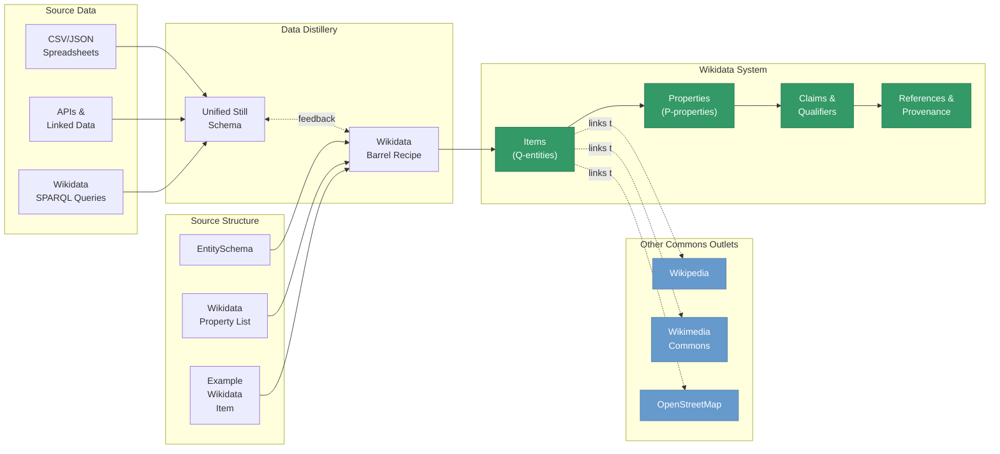

# Wikidata: The Structured Data Foundation

## Wikidata's Central Role in the Global Knowledge Commons

Wikidata serves as the **primary structured data backbone** of the Global Knowledge Commons. While the GKC distillery workflow distributes data to multiple open knowledge platforms—Wikipedia, Wikimedia Commons, and OpenStreetMap—Wikidata holds a unique position as the authoritative, machine-readable source of structured facts and relationships that other platforms reference and build upon.

### Why Wikidata is Central

**1. Structured Knowledge Graph**  
Wikidata is a collaboratively-edited knowledge graph of structured data—entities, properties, relationships, and metadata. Unlike Wikipedia's narrative text or Commons' media files, Wikidata represents knowledge as a web of linked facts that machines can query, reason with, and reuse programmatically.

**2. Cross-Platform Integration Hub**  
Wikidata items serve as canonical identifiers that link information across the entire Commons:

- **Wikipedia** some infoboxes pull facts directly from Wikidata rather than duplicating them
- **Wikimedia Commons** media files link to Wikidata items to connect images with structured information about their subjects
- **OpenStreetMap** features can reference Wikidata IDs to enrich geographic data with encyclopedic context; some of the semantics of OSM tags are enhanced through inclusion in Wikidata's graph representation
- **External systems** (libraries, museums, academic databases) use Wikidata as a cross-reference layer between their own authority files

**3. Authority Control & Entity Reconciliation**  
Wikidata items provide stable, persistent identifiers (QIDs) for real-world entities. This makes Wikidata the natural reconciliation target during the **Distillation** stage of the GKC pipeline—matching source records to canonical entities in a shared knowledge space.

**4. Schema-Driven Development**  
Wikidata EntitySchemas (written in ShEx) define the structure, constraints, and expected patterns for specific classes of items. These schemas provide:

- **Validation rules** that ensure data quality and consistency
- **Documentation** that explains how entities should be modeled
- **Mapping templates** that guide transformation of source data into Wikidata's format

In the GKC workflow, Wikidata EntitySchemas serve as the primary source for building **Barrel Schemas** that create a common structure defining how data should be shaped and organized for delivery to the target system.

## Wikidata in the Distillery Workflow

### The Wikidata Transformation Path

1. **Source → Still Schema**: Raw data is transformed into the canonical Unified Still Schema
2. **Still → Barrel Recipe**: The Wikidata Barrel Recipe maps Still Schema fields to Wikidata properties, qualifiers, and references
3. **Recipe → EntitySchema Validation**: Generated items are validated against Wikidata EntitySchemas to ensure conformance
4. **Bottling → Wikidata API**: Valid items are submitted to Wikidata via authenticated API calls

**Key difference from other targets**: Wikidata transformation isn't just about formatting data—it's about **entity linking**, **property selection**, **qualifier enrichment**, and **reference documentation**. The richness of Wikidata's data model requires more sophisticated mapping than simple key-value conversions.

## Core Wikidata Capabilities in GKC

The GKC package provides comprehensive support for working with Wikidata across the entire distillery workflow:

### Schema-Driven Development

**[RecipeBuilder](claims_map_builder.md)** - Auto-generate mapping configurations from Wikidata EntitySchemas
- Parses ShEx schemas to extract property requirements and cardinality
- Fetches live property metadata (datatypes, labels, descriptions) from Wikidata
- Combines both sources to produce documented mapping skeletons with sensible defaults

### Item Creation & Contribution

**[Item Creation Approach](item_creation_approach.md)** - Strategy for creating well-formed Wikidata items
- ShEx-guided validation ensures items meet community standards before submission
- Property mapping configurations separate data logic from transformation rules
- Authenticated API submission with provenance tracking

### Structured Claims & References

**[Claims Map Builder](claims_map_builder.md)** - Transform source data into Wikidata claims with qualifiers
- Support for complex datatypes: Time, Quantity, MonolingualText, GlobeCoordinate
- Qualifier patterns for contextualization (dates, locations, references)
- **[Reference & Qualifier Patterns](reference_qualifier_patterns.md)** - Best practices for sourcing and contextualizing claims

### Date & Time Handling

**[Date/Time Handling](date_time_handling.md)** - Robust parsing and transformation of temporal data
- Multiple input formats (ISO 8601, natural language, partial dates)
- Automatic precision detection (year, month, day, time)
- Wikidata Time datatype generation with calendar models

### Sitelinks Management

**[Sitelinks Usage](sitelinks_usage.md)** - Connect Wikidata items to Wikipedia articles and other Wikimedia projects
- Map source data to Wikipedia article titles across languages
- Handle redirects, disambiguation pages, and naming variations
- **[Sitelinks Validation](sitelinks_validation.md)** - Ensure links point to valid, existing pages

### SPARQL Querying

**[SPARQL Queries](../sparql_queries.md)** - Query Wikidata's knowledge graph to inform transformations
- Reconcile source records by matching on properties and constraints
- Retrieve existing item structures to guide mapping decisions
- **[SPARQL Quick Reference](../sparql_quick_reference.md)** - Common patterns and query templates

## EntitySchemas as Barrel Schemas

In the GKC distillery metaphor, **Wikidata EntitySchemas are Barrel Schemas**—they define the shape, constraints, and validation rules for the target system. 

An EntitySchema like [E502 (Federally Recognized Tribe)](https://www.wikidata.org/wiki/EntitySchema:E502) specifies:

- **Required properties**: What must be present for an item to be valid (e.g., P31=instance of, P17=country)
- **Optional properties**: What may be present to enrich the item (e.g., P571=inception, P2124=member count)
- **Value constraints**: What types of values are allowed (e.g., P17 must be wd:Q30 for United States)
- **Cardinality**: How many times a property can appear (e.g., P571 can appear 0+ times)
- **Qualifiers & references**: What additional context should accompany claims

The GKC workflow leverages EntitySchemas at multiple stages:

1. **Fermentation**: Early validation during data cleaning to catch issues before reconciliation
2. **Refinement**: Shape validation after reconciliation to ensure completeness
3. **Proofing**: Quality assurance checks before bottling
4. **Bottling**: Final validation before API submission

## Wikidata's Unique Challenges

Working with Wikidata presents distinct challenges that the GKC package addresses:

### Entity Reconciliation
**Challenge**: Matching source records to existing Wikidata items (or determining when to create new ones)  
**GKC Approach**: SPARQL-based reconciliation strategies, confidence scoring, and human validation gates

### Property Selection
**Challenge**: Choosing the right property from thousands of options to represent a source field  
**GKC Approach**: Schema-guided property recommendations, property metadata lookups, and mapping templates

### Complex Datatypes
**Challenge**: Transforming source values into Wikidata's structured datatypes (Time, Quantity, Coordinate)  
**GKC Approach**: Datatype-specific transform functions with automatic format detection and parsing

### Qualifier Patterns
**Challenge**: Knowing when and how to use qualifiers to contextualize claims  
**GKC Approach**: Pattern recognition from EntitySchemas and configurable qualifier rules

### Reference Documentation
**Challenge**: Providing proper sourcing for every claim to meet Wikidata's verifiability standards  
**GKC Approach**: Automatic reference generation from source metadata with customizable reference patterns

### Multilingual Labels
**Challenge**: Handling names, aliases, and descriptions across multiple languages  
**GKC Approach**: MonolingualText handling, language-specific mapping configurations, and label conflict resolution

## Why Start with Wikidata?

The GKC package began with a focus on Wikidata because:

1. **Structured foundation first**: Establishing canonical entities and facts in Wikidata creates a foundation that other platforms can reference
2. **SchemaComplexity**: Wikidata's rich data model (items, properties, claims, qualifiers, references) requires sophisticated tooling—solving this problem makes other targets easier
3. **Authority control**: Wikidata QIDs become the linking mechanism across all Commons platforms
4. **Community maturity**: Wikidata has well-developed schemas (EntitySchemas), property documentation, and community standards that provide clear transformation targets

Once data is in Wikidata, extending to Wikipedia (infoboxes), Commons (media metadata), and OpenStreetMap (feature enrichment) becomes a matter of reformatting and re-purposing the same underlying facts—all **linked by canonical Wikidata identifiers**.

## Next Steps

- **New to Wikidata?** Start with the [Item Creation Approach](item_creation_approach.md) to understand the end-to-end workflow
- **Building mappings?** Use the [RecipeBuilder](claims_map_builder.md) to auto-generate configurations from EntitySchemas
- **Working with time data?** See [Date/Time Handling](date_time_handling.md) for robust temporal transformations
- **Need to query Wikidata?** Check out the [SPARQL Quick Reference](../sparql_quick_reference.md) for common patterns
- **Linking to Wikipedia?** Review [Sitelinks Usage](sitelinks_usage.md) for best practices

---

*Remember: In the Global Knowledge Commons, Wikidata is not just another target—it's the **structured data backbone** that makes machine-readable knowledge accessible, reusable, and connected across platforms.*
