# GKC Pipeline Overview

The Data Distillery Workflow transforms raw, disconnected data into refined, linked open data through a series of intentional stages. Each stage adds value: cleaning, linking, validating, and ultimately preparing data for contribution to open knowledge sources.

## The End-to-End Vision

```mermaid
graph TD
    subgraph sources["🥔 Raw Ingredients"]
        CSV["CSV Files"]
        JSON["JSON APIs"]
        SHEETS["Spreadsheets"]
        RDF["RDF/Linked Data"]
        OSM["OSM Extracts"]
    end

    subgraph ingestion["Stage 1: Data Ingestion"]
        MASH["<b>Mash Tun</b><br/>Parse & Structure<br/>━━━━━━━━━━━━<br/>Read diverse formats<br/>Structural validation<br/>Initial enrichment"]
    end

    subgraph transform["Stage 2: Data Integration"]
        FERMENT["<b>Fermentation</b><br/>Clean & Normalize<br/>━━━━━━━━━━━━<br/>Fix encoding, whitespace<br/>Type coercion<br/>Schema alignment"]
        
        DISTILL["<b>Distillation</b><br/>Reconcile & Link<br/>━━━━━━━━━━━━<br/>Match to Wikidata items<br/>Find OSM features<br/>Resolve ambiguity"]
        
        REFINE["<b>Refinement</b><br/>Dedup & Enrich<br/>━━━━━━━━━━━━<br/>Collapse duplicates<br/>Add cross-references<br/>Shape validation"]
        
        PROOF["<b>Proofing</b><br/>Quality Assurance<br/>━━━━━━━━━━━━<br/>Completeness metrics<br/>Confidence scoring<br/>Integrity checks"]
        
        BLEND["<b>Blending</b><br/>Merge & Unify<br/>━━━━━━━━━━━━<br/>Combine sources<br/>Resolve conflicts<br/>Build knowledge graph"]
    end

    subgraph delivery["Stage 3: Data Delivery"]
        BOTTLE["<b>Bottling</b><br/>Format & Export<br/>━━━━━━━━━━━━<br/>JSON-LD, TSV, RDF<br/>Infobox templates<br/>Batch uploads"]
    end

    subgraph outputs["🍷 Refined Output"]
        WD["Wikidata<br/>New Items<br/>& Claims"]
        WIKI["Wikipedia<br/>Infobox<br/>Templates"]
        COMMONS["Wikimedia<br/>Commons<br/>Items"]
        OSM_OUT["OpenStreetMap<br/>Features &<br/>Tags"]
    end

    subgraph support["🛞 Supporting Systems"]
        BARREL["Barrel<br/>Caching & Provenance"]
        SCHEMA["Schema Registry<br/>Properties & References"]
        SAFE["Spirit Safe<br/>Validation Gates"]
        ANGEL["Angel's Share<br/>Schema Deviations"]
    end

    sources --> MASH
    MASH --> FERMENT
    FERMENT --> DISTILL
    DISTILL --> REFINE
    REFINE --> PROOF
    PROOF --> BLEND
    BLEND --> BOTTLE
    BOTTLE --> WD
    BOTTLE --> WIKI
    BOTTLE --> COMMONS
    BOTTLE --> OSM_OUT

    MASH -.-> BARREL
    DISTILL -.-> BARREL
    PROOF -.-> BARREL
    
    FERMENT -.-> SCHEMA
    DISTILL -.-> SCHEMA
    
    REFINE -.-> SAFE
    PROOF -.-> SAFE

    FERMENT -.-> ANGEL
    REFINE -.-> ANGEL
    PROOF -.-> ANGEL
    BLEND -.-> ANGEL
    BOTTLE -.-> ANGEL

    style sources fill:#f4d4a8
    style ingestion fill:#e8d4c4
    style transform fill:#dfc0b0
    style delivery fill:#d4a89c
    style outputs fill:#4a90e2
    style support fill:#f0f0f0
```

## Stage Index (Quick Links)

- [Mash Tun](mash_tun.md) — Data ingestion and parsing
- [Fermentation](fermentation.md) — Cleaning and normalization
- [Distillation](distillation.md) — Reconciliation and entity linking
- [Refinement](refinement.md) — Deduplication and enrichment
- [Proofing](proofing.md) — Quality assurance and confidence scoring
- [Blending](blending.md) — Multi-source merging and conflict resolution
- [Bottling](bottling.md) — Format and export

---

## Inputs and Outputs at a Glance

| Stage | Primary Inputs | Primary Outputs |
|------|----------------|-----------------|
| **Mash Tun** | Raw files, APIs, databases, RDF | Parsed records with canonical fields and provenance |
| **Fermentation** | Parsed records | Clean, typed, schema-conformant records |
| **Distillation** | Clean records | Canonical links (QIDs/OSM IDs) + confidence scores |
| **Refinement** | Linked records | Deduplicated, enriched, shape-validated records |
| **Proofing** | Refined records | Quality scores, pass/review/fail status |
| **Blending** | Proofed datasets | Unified dataset with merged provenance |
| **Bottling** | Blended dataset | Target-specific exports and reports |

## Stage-by-Stage Breakdown

### **Stage 1: Data Ingestion** 🥔

**Mash Tun** — Read and parse heterogeneous data sources into a standardized working format.

| Aspect | Details |
|--------|---------|
| **Input** | CSV, JSON, spreadsheets, API dumps, RDF, databases |
| **Core Task** | Structural parsing, encoding normalization, basic type detection |
| **Key Decision** | Which fields/properties matter? What's hierarchical vs. flat? |
| **Output** | Standardized records with identified fields |
| **User Focus** | "How do I ingest my data source?" |

---

### **Stage 2: Data Integration** ⚙️

This is where the real work happens—transforming messy data into something that can be reliably matched, enriched, and validated.

#### **Fermentation** — Cleaning & Normalization
Sanitize and conform all records to a consistent schema informed by your targets (Wikidata, OSM).

| Aspect | Details |
|--------|---------|
| **Input** | Parsed records from Mash Tun |
| **Core Task** | Whitespace trimming, type coercion, encoding fixes, missing value handling |
| **Quality Check** | Do all records conform to your schema? Are there obvious typos or encoding issues? |
| **Output** | Clean records, all conforming to expected schema |
| **Decision Point** | How strict? Should unknown values be dropped, kept, or flagged? |

#### **Distillation** — Reconciliation & Entity Linking
Link source records to authoritative reference systems (Wikidata items, OSM features, external authorities).

| Aspect | Details |
|--------|---------|
| **Input** | Clean, normalized records |
| **Core Task** | Match to Wikidata QIDs, OSM IDs, authority files; assign confidence scores |
| **Methods** | String matching, heuristics, external authority lookups, manual overrides |
| **Output** | Records with explicit links to canonical entities + confidence metadata |
| **Decision Point** | What confidence threshold? When to mark ambiguous vs. high-confidence? |

#### **Refinement** — Deduplication & Enrichment
Collapse duplicate matches, enrich with cross-references, validate against schemas (ShEx).

| Aspect | Details |
|--------|---------|
| **Input** | Reconciled records with entity links |
| **Core Task** | Deduplicate variants, add relationships/sitelinks, run shape constraints |
| **Output** | Deduplicated, enriched records meeting all shape requirements |
| **Decision Point** | Which version of a duplicate to keep? How to handle conflicts? |

#### **Proofing** — Quality Assurance & Confidence Scoring
Score each record against multi-dimensional quality metrics and assign fitness scores for downstream use.

| Aspect | Details |
|--------|---------|
| **Input** | Refined, deduplicated records |
| **Core Task** | Run quality metrics: completeness, consistency, confidence, internal coherence |
| **Output** | Records with quality scores, flags, and audit trails |
| **Decision Point** | What quality threshold? What's acceptable for each downstream destination? |

#### **Blending** — Multi-Source Merging & Conflict Resolution
Combine cleaned/reconciled datasets from multiple sources into a unified knowledge graph.

| Aspect | Details |
|--------|---------|
| **Input** | Multiple proofed datasets |
| **Core Task** | Merge entity records, resolve value conflicts, build cross-source relationships |
| **Output** | Unified, deduplicated dataset with provenance tracking |
| **Decision Point** | Which source takes precedence when values conflict? How to weight different signals? |

---

### **Stage 3: Data Delivery** 🍷

#### **Bottling** — Format & Export
Transform final data into formats for each downstream destination.

| Aspect | Details |
|--------|---------|
| **Input** | Final blended, quality-assured dataset |
| **Outputs** | Multiple formats optimized for each target system |
| **Formats** | Wikidata JSON, infobox templates, Commons metadata, OSM tags |
| **Delivery** | Batch exports, API readiness, upload staging |
| **Decision Point** | Which format for which destination? Batch size? Validation before upload? |

---

## Supporting Systems 🛞

These systems run in parallel, supporting all stages:

### **Barrel** (Caching & Provenance)
- Persistent storage of intermediate results and snapshots
- Complete provenance trail (what was filtered, why, when)
- Enables rollback and reuse without re-computation
- Audit trail for regulatory/transparency needs

### **Schema Registry** (Properties & Reference Data)
- Catalog of recognized properties and valid values
- Entity schemas for Wikidata, OSM, Commons
- Authority files and reference lookups
- Quality rule definitions

### **Spirit Safe** (Validation & Quality Gates)
- Shape constraints (ShEx validation)
- Reference integrity checks
- Business rule enforcement
- "Pass/fail" decision points throughout the pipeline

---

## Stage Artifacts and Decision Checkpoints

Each stage produces tangible artifacts that make progress visible and reviewable.

| Stage | Typical Artifacts | Decision Checkpoints |
|------|--------------------|----------------------|
| **Mash Tun** | Parsed records, source mappings, ingestion logs | Source field mapping accepted? Missing columns tolerated? |
| **Fermentation** | Cleaned records, coercion logs, language/character flags | Strict or lenient parsing? Missing data policy? |
| **Distillation** | Match candidates, confidence scores, link audit logs | Confidence thresholds? Manual review queue? |
| **Refinement** | Merge logs, dedup reports, schema validation output | Conflict strategy? Enrichment depth? |
| **Proofing** | Quality scores, review queue, anomaly flags | Pass/review/fail thresholds? Outlier policy? |
| **Blending** | Merge decisions, provenance map, conflict summaries | Source priority rules? Alternate value handling? |
| **Bottling** | Export batches, validation reports, preview artifacts | Dry-run vs. publish? Batch size limits? |

---

## Key Principles

1. **Each stage is a decision point**: Users configure how their data moves through the pipeline
2. **Provenance is built-in**: Every transformation logged; nothing disappears without trace
3. **Multiple paths out**: The same cleaned, reconciled data can be delivered to Wikidata, Wikipedia, Commons, and OSM in different formats
4. **Flexible depth**: Users can stop at any stage (e.g., reconciliation-only, no delivery) or skip stages if not needed
5. **Quality over speed**: Better to catch issues early (fermentation/distillation) than late (proofing)
6. **Angel's Share is preserved**: Schema deviations are retained with notes for future schema expansion or alternate endpoints

---

## Common Workflows

### Simple Case: "Link my data to Wikidata"
**Mash** → **Ferment** → **Distill** → **Bottle** (to Wikidata)

### Complex Case: "Integrate three datasets, then export to multiple targets"
**Mash** (×3) → **Ferment** (×3) → **Distill** (×3) → **Refine** (×3) → **Proof** (×3) → **Blend** → **Bottle** (×4 formats)

### Quality-First Case: "Ensure high-confidence data only"
**Mash** → **Ferment** → **Distill** → **Refine** → **Proof** (high-confidence filter) → **Bottle**

---

## Next Steps

Visit the relevant stage documentation for:
- Detailed API reference
- Configuration examples
- Real use cases walking through decisions
- Troubleshooting and common patterns
